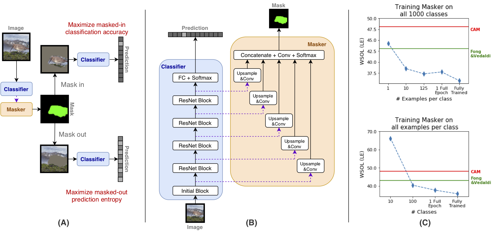

# Investigating and Simplifying Masking-based Saliency Methods for Model Interpretability

This repository contains code for running and replicating the experiments from [Investigating and Simplifying Masking-based Saliency Methods for Model Interpretability](https://arxiv.org/abs/2010.09750). It is a modified fork of [Classifier-Agnostic Saliency Map Extraction](https://github.com/kondiz/casme), and contains the code originally forked from the [ImageNet training in PyTorch](https://github.com/pytorch/examples/tree/master/imagenet).

<p align="center">
    <br>
    
    <br>
<p>

*(A) Overview of the training setup for our final model. The masker is trained to maximize masked-in classification accuracy and masked-out prediction entropy.*  
*(B) Masker architecture. The masker takes as input the hidden activations of different layers of the ResNet-50 and produces a mask of the same resolution as the input image.*  
*(C) Few-shot training of masker. Performance drops only slightly when trained on much fewer examples compared to the full training procedure.*


## Software requirements

- This repository requires Python 3.7 or later.
- Experiments were run with the following library versions:

```
pytorch==1.4.0
torchvision==0.5.0
opencv-python==4.1.2.30
beautifulsoup4==4.8.1
tqdm==4.35.0
pandas==0.24.2
scikit-learn==0.20.2
scipy==1.3.0 
```

In addition, `git clone https://github.com/zphang/zutils` and add it to your `PYTHONPATH`


**Additional requirements**

- If you want to use the PxAP metric from [Evaluating Weakly Supervised Object Localization Methods Right](https://arxiv.org/abs/2007.04178):
    - `git clone https://github.com/clovaai/wsolevaluation` and add it to your `PYTHONPATH`. To avoid potential naming conflicts, add it to the front of your `PYTHONPATH`.
    - `pip install munch` (as well as any other requirements listed [here](https://github.com/clovaai/wsolevaluation#3-code-dependencies))
- If you want to run the Grad-CAM and Guided-backprop saliency methods:
    - `pip install torchray`, or `git clone https://github.com/facebookresearch/TorchRay` and add it to your `PYTHONPATH`
- If you want to use the CA-GAN infiller from [Generative Image Inpainting with Contextual Attention](https://arxiv.org/abs/1801.07892)
    - `git clone https://github.com/daa233/generative-inpainting-pytorch` and add it to your `PYTHONPATH`
    - Download the linked [pretrained model](https://drive.google.com/drive/folders/123-F7eSAXJzgztYj2im2egsuk4mY5LWa) for PyTorch, and set environment variable `CA_MODEL_PATH` to point to it 
- If you want to use the DFNet infiller from [https://arxiv.org/abs/1904.08060](https://arxiv.org/abs/1904.08060)
    - `git clone https://github.com/hughplay/DFNet` and add it to your `PYTHONPATH`
    - Download the linked [pretrained model](https://github.com/hughplay/DFNet#testing) for PyTorch, and set environment variable `DFNET_MODEL_PATH` to point to it. Use the Places 2 model.
    

## Data requirements

- ImageNet dataset should be stored in `IMAGENET_PATH` path and set up in the usual way (separate `train` and `val` folders with 1000 subfolders each). See [this repo](https://github.com/facebook/fb.resnet.torch/blob/master/INSTALL.md#download-the-imagenet-dataset) for detailed instructions how to download and set up the dataset.
- ImageNet bounding box annotations should be in `IMAGENET_ANN` directory that contains 50000 files named `ILSVRC2012_val_<id>.xml` where `<id>` is the validation image id (for example `ILSVRC2012_val_00050000.xml`). It may be simply obtained by unzipping [the official validation bounding box annotations archive](http://www.image-net.org/challenges/LSVRC/2012/dd31405981ef5f776aa17412e1f0c112/ILSVRC2012_bbox_val_v3.tgz) to `IMAGENET_ANN` directory. 
- Bounding box annotations for parts of the training set can downloaded from [here](http://image-net.org/Annotation/Annotation.tar.gz). This will be used for our Train-Validation set. 
- If want to use the PxAP metrics from [Evaluating Weakly Supervised Object Localization Methods Right](https://arxiv.org/abs/2007.04178):
    - Download the relevant datasets in described [here](https://github.com/clovaai/wsolevaluation#2-dataset-downloading-and-license)

## Running the code

We will assume that experiments will be run in the following folder:

```bash
export EXP_DIR=/path/to/experiments
```

### Data Preparation
To facilitate easy subsetting and label shuffling for the ImageNet training set, we write a JSON files containing the paths to the example images, and their corresponding labels. These will be consumed by a modified ImageNet PyTorch Dataset.

Run the following command:

```bash
python casme/tasks/imagenet/preproc.py \
    --train_path ${IMAGENET_PATH}/train \
    --val_path ${IMAGENET_PATH}/val \
    --val_annotation_path ${IMAGENET_ANN}/val \
    --output_base_path ${EXP_DIR}/metadata
```

This script does several things:

- Packages the ImageNet Train and Validation image data and labels into metadata JSON files (`train.json`, `val.json`)
- Splits the train data into Train-Train and Train-Validation subsets (`train_train.json`, `train_val.json`)
- Generates a shuffled version of the Train JSON (`train_shuffle.json`) for DRT Sanity Check
- Also packages the bounding box annotation for the Validation set into JSON files (`val_bboxes.json`)
- Optionally, to use bounding boxes for the Train-Validation set, unzip the downloaded data from [here](http://image-net.org/Annotation/Annotation.tar.gz), and provided an additional argument `--extended_annot_base_path`. (`train_val_bboxes.json`)

### Training

To train a FIX or CA model, you can run:

```bash
python train_casme.py \
    --train_json ${EXP_DIR}/metadata/train.json \
    --val_json ${EXP_DIR}/metadata/val.json \
    --ZZsrc ./assets/fix.json \
    --masker_use_layers 3,4 \
    --output_path ${EXP_DIR}/runs/ \
    --epochs 60 --lrde 20 \
    --name fix

python train_casme.py \
    --train_json ${EXP_DIR}/metadata/train.json \
    --val_json ${EXP_DIR}/metadata/val.json \
    --ZZsrc ./assets/ca.json \
    --masker_use_layers 3,4 \
    --output_path ${EXP_DIR}/runs/ \
    --epochs 60 --lrde 20 \
    --name ca
```

- The `--ZZsrc` arguments provide JSON files with additional options for the command-line interface. `./assets/fix.json` and `./assets/ca.json` contain options and final hyper-parameters chosen for the FIX and CA models in the paper. 
- We also only use the 4th and 5th layers from the classifier in the masker model.
- `--train_json` and `--val_json` point to the JSON files containing the paths to the example images, and their corresponding labels, described above.

### Evaluation

To evaluate the model on WSOL metrics and Saliency Metric, run:

```bash
python casme/tasks/imagenet/score_bboxes.py \
    --val_json ${EXP_DIR}/metadata/val.json \
    --mode casme \
    --bboxes_path ${EXP_DIR}/metadata/val_bboxes.json \
    --casm_path ${EXP_DIR}/runs/ca/epoch_XXX.chk \
    --output_path ${EXP_DIR}/runs/ca/metrics/scores.json
``` 

where `epoch_XXX.chk` corresponds to the model checkpoint you want to evaluate. Chain the `val_json` and `bboxes_path` paths to evaluate on the Train-Validation or Validation sets respectively. Note that the mode should be `casme` regardless of whether you are using FIX or CA models.

The output JSON looks something like this:
```
{
  "F1": 0.6201832851563015,
  "F1a": 0.5816041554785251,
  "OM": 0.48426,
  "LE": 0.35752,
  "SM": 0.523097248590095,
  "SM1": -0.5532185246243142,
  "SM2": -1.076315772478443,
  "top1": 75.222,
  "top5": 92.488,
  "sm_acc": 74.124,
  "binarized": 0.4486632848739624,
  "avg_mask": 0.44638757080078123,
  "std_mask": 0.1815464876794815,
  "entropy": 0.034756517103545534,
  "tv": 0.006838996527194977
}
```

- OM, LE, F1, SM and `avg_mask` correspond to the respective columns in Table 1.
- For a given image, an F1-score is compute for each of the bounding boxes. F1 takes the max while F1a takes the mean F1-score for all boxes in the image, and the result is averaged over all the images in the dataset.  
- SM1 and SM2 refer to the first and second terms of the Saliency Metric formulation. `sm_acc` is the top-1 accuracy under the crop-and-scale transformation for the Saliency Metric. 
- Top 1 and Top 5 are the accuracies of the classifier.
- Binarized the is average over the binarized mask pixels over the whole dataset. `std_mask` is the Standard deviation of the continuous mask pixels over the dataset.
- TV is the total variation, entropy is the entropy over predictions for masked imaged.

To evaluate the model on PxAP, run:

```bash
python casme/tasks/imagenet/wsoleval.py \
    --cam_loader casme \
    --casm_base_path ${EXP_DIR}/runs/ca/epoch_XXX.chk \
    --casme_load_mode specific \
    --dataset OpenImages \
    --dataset_split test \
    --dataset_path ${WSOLEVAL_PATH}/dataset \
    --metadata_path ${WSOLEVAL_PATH}/metadata \
    --output_base_path ${EXP_DIR}/runs/ca/metrics/scores.json
```

where `WSOLEVAL_PATH` is the location where [wsolevaluation](https://github.com/clovaai/wsolevaluation) has been cloned to, and after running the relevant dataset downloading scripts.

## Pretrained Checkpoints

- [fix.chk](https://drive.google.com/file/d/1m4-oHYZYalk4VKcs_GDh-9UB657PcMSw/view?usp=sharing) corresponds to our best-performing FIX model (Row I of Table 1).
- [ca.chk](https://drive.google.com/file/d/1RPoTtj4RWtx8QsJ9RokFi5r6Wd4y805v/view?usp=sharing) corresponds to our best-performing CA model (Row J of Table 1).

## Reference

If you found this code useful, please cite [the following paper](https://arxiv.org/abs/2010.09750):

Jason Phang, Jungkyu Park, Krzysztof J. Geras **"Investigating and Simplifying Masking-based Saliency Methods for Model Interpretability."** *arXiv preprint arXiv:2010.09750 (2020).*
```
@article{phang2020investigating,
  title={Investigating and Simplifying Masking-based Saliency Methods for Model Interpretability},
  author={Phang, Jason and Park, Jungkyu and Geras, Krzysztof J},
  journal={arXiv preprint arXiv:2010.09750},
  year={2020}
}
```